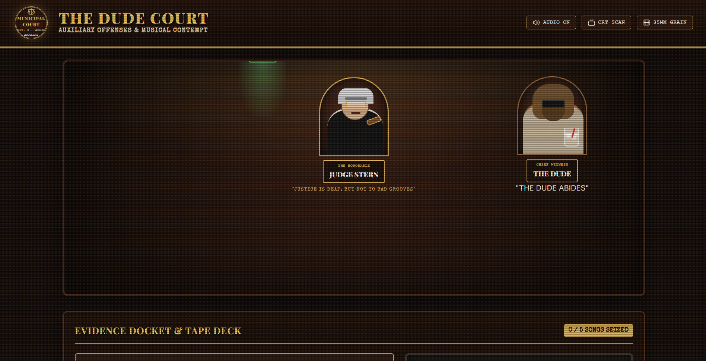
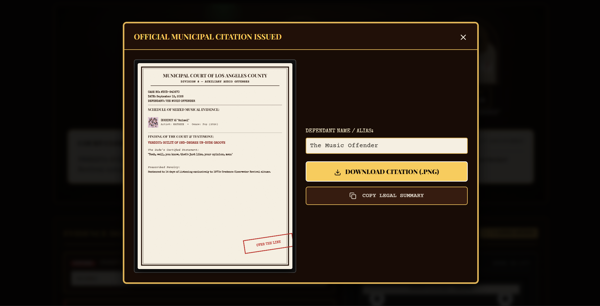

# The Dude Court

A 1970s-themed interactive courtroom web app where users stand trial for their questionable music taste, presided over by an outraged magistrate and "The Dude" from _The Big Lebowski_.

## Description

**The Dude Court** puts your music library under municipal indictment. Built with HTML5, CSS3, Vanilla JavaScript, and the Web Audio API, the app renders a 1970s municipal courtroom where the Honorable Judge Stern presides at a mahogany bench under a glowing green banker's lamp. Meanwhile, **The Dude** lounges in the witness box in an oversized bathrobe and dark sunglasses, swirling a White Russian and delivering slacker-philosophical commentary on every song seized into evidence.

The app integrates with the public **Apple iTunes Search API** for real-time track searches, retrieving album artwork, release years, genre tags, and 30-second audio previews. Users seize 1 to 5 tracks into the "Court Evidence Docket" (Exhibits A through E), which loads onto a vintage 1970s cassette recorder equipped with rotating tape reels, a mechanical counter, and an analog VU meter driven in real time by Web Audio frequency analysis.

During the interactive trial sequence, a procedural roast engine classifies track metadata and orchestrates a back-and-forth courtroom dialogue. Gavel strikes trigger sub-bass acoustic pulses and screen-shake animations, while White Russian ice clinks and typewriter speech balloons deliver custom roasts : featuring special easter egg handling for Creedence Clearwater Revival (acquittal), The Eagles (extreme outrage), Pop/Viral Hits (conformism charges), and 808 Trap (sub-bass noise violations). Upon completion, a native **HTML5 Canvas generator** outputs a downloadable 1970s Los Angeles County Municipal Citation printed on aged carbon paper with distressed rubber stamps (_"THE DUDE ABIDES"_ or _"OVER THE LINE - MARK IT ZERO"_).

## Screenshots





## Getting Started

### Dependencies

Before running The Dude Court: Auxiliary Offenses, ensure you have the following installed:

- Python 3.x (for the local dev server) : or any static file server
- A modern web browser with HTML5 Canvas, SVG, and Web Audio API support (Chrome, Firefox, Edge, or Safari)
- Windows 10/11, macOS, or Linux operating system

### Installing

1. Clone the repository to your local computer:

```bash
git clone https://github.com/questcreators69-rgb/dude_court.git
```

2. Navigate to the project directory:

```bash
cd dude_court
```

3. No package installation is required. The project has zero external runtime dependencies and uses native Web Audio synthesis.

### Executing program

1. Start a local development server (required for music search and audio preview streaming):

```bash
python -m http.server 5500
```

2. Open your web browser and navigate to `http://localhost:5500`.

3. Click anywhere on the page to initialize the Web Audio API context.

**Controls:**

- **Search Music Database**: Type an artist, track, or genre into the `SUBPOENA SEARCH MUSIC DATABASE` field
- **Seize Evidence**: Click `+ SEIZE` on any result to add it to the Evidence Docket (Exhibits A–E)
- **Commence Trial**: Click `PRESENT EVIDENCE & COMMENCE TRIAL` to launch the courtroom indictment sequence
- **Tape Deck**: Use `▶ PLAY`, `❚❚ PAUSE`, or `◼ STOP` on the cassette deck to preview tracks
- **Export Citation**: Click `DOWNLOAD CITATION (.PNG)` or `COPY LEGAL SUMMARY` in the verdict modal
- **Visual Filters**: Toggle `CRT SCAN` or `35MM GRAIN` in the toolbar for retro visual overlays
- **Audio Toggle**: Click `AUDIO ON` / `MUTED` in the toolbar to toggle sound effects

## Help

- **No Audio**: Browsers block automated audio playback until the user interacts with the page. Click anywhere inside the app after loading to enable sound.
- **Port Conflict**: If port `5500` is already in use, launch the server on a different port:

```bash
python -m http.server 8080
```

Then open `http://localhost:8080` instead.

- **Search Not Working**: The app routes iTunes API requests through a CORS proxy. If results don't appear, check your internet connection. An offline fallback track database (CCR, Eagles, Taylor Swift, Drake, Metallica) ensures the trial can always proceed.
